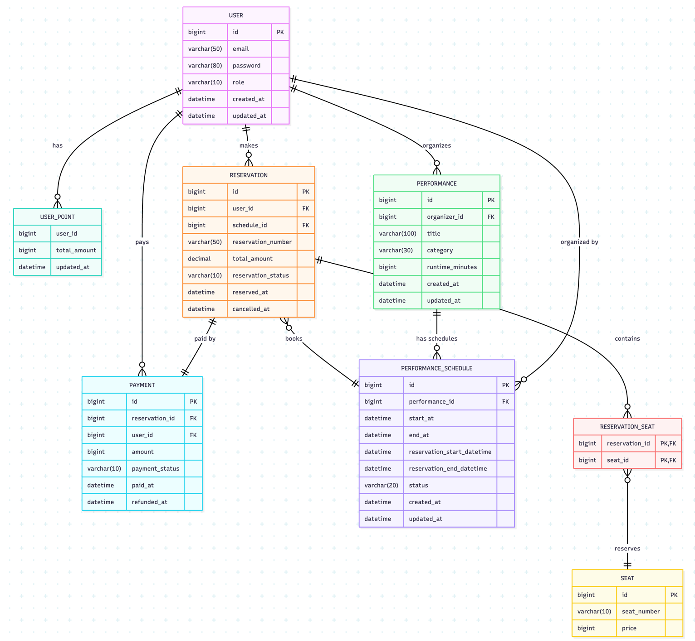

# 프로젝트 설명

- 프로젝트명: 커튼콜
- 주제: 공연 티켓팅 애플리케이션
- 기술 스택: `Java17`, `SpringBoot 3.4.8`, `MySQL`, `MyBatis` 

# 요구사항

## 1. 인증/인가

### 1-1. 회원가입
[1] 이메일/비밀번호 기반 회원가입을 지원한다.
- 유저의 이메일은 고유하다.
- 유저의 비밀번호 정보는 단방향 암호화를 진행하여 DB에 저장한다. (SHA256)

### 1-2. 로그인
[1] 유저 인증 방식은 JWT토큰 방식과 Session 방식 중 하나를 선택하여 구현한다.

### 1-3. 권한 관리
[1] 유저는 다음과 같은 권한을 부여 받고 권한에 따라 접근할 수 있는 기능이 나뉘어진다.
- 일반 사용자(MEMBER): 티켓 구매, 예약, 취소
- 주최자(ORGANIZER): 공연 관리, 티켓 관리 등의 기능 제공
- 관리자(ADMIN): 전체 시스템 기능 접근 가능

## 2. 공연 관리

### 2-1. 공연 등록 / 수정 / 삭제

[1] 유저(주최자)는 공연을 등록, 수정, 삭제할 수 있다.
- 공연 데이터는 아래와 같은 데이터가 필요하다.
  - 공연명, 카테고리, 공연일시, 런타임 시간, 티켓 가격, 예약 일시, 좌석 타입
  - 공연은 한가지 상태를 가지고 있다. (SCHEDULED, ONGOING, ENDED, CANCELLED)
    _- 상태 업데이트는 스케줄러를 사용해야할까? (이부분은 우선순위에서 후순위)_

### 2-2. 공연 검색

[1] 유저는 공연을 검색할 수 있다.
- 검색은 필터 조건을 사용하여 검색할 수 있다. (가격, 별점, 날짜 등)
- 검색 결과는 페이징 or 무한 스크롤 방식 중 한가지를 선택하여 제공한다.

## 3. 예매

[1] 유저는 좌석을 조회할 수 있다.
- 이미 선점된 좌석은 선택이 불가능하도록 제공한다.

[2] 유저는 공연을 예매할 수 있다.
- 예매 시 좌석을 선택해야한다.
  - 유저가 좌석을 선택하면 일정시간동안 해당 좌석이 선점 상태가 된다. 결제까지 일정 시간동안 이어지지 않으면 락이 풀린다.
- 결제 기능은 실제 연동까지는 가지 않는다.
- 유저는 예매 내역을 취소할 수 있다. (후순위)

## 주요 고민 포인트

- 좌석을 선점하는 방식으로 가야할지, 그냥 선착순 티켓만 발급하는 방식으로 가야할지 정해야 구체적인 구현 방식이 정해질 수 있다.
  - 선착순 티켓 방식일 경우 Queue를 활용하여 구현할 수 있을것으로 판단됨.
  - 좌석 선점의 경우 비관적락 or 분산락 등으로 처리.

## 와이어 프레임

- [issue link](https://github.com/f-lab-edu/curtain-call/issues/5)

## ERD

