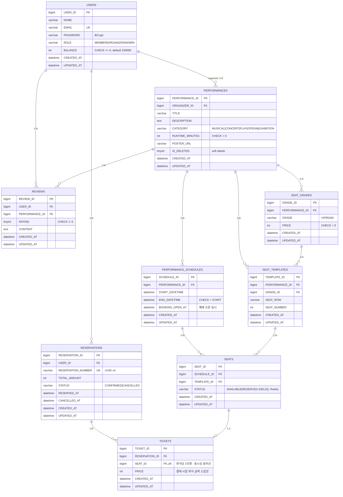

# 커튼콜 ERD 수정본 (리뷰 반영)

- 작성일: 2026-05-31
- 기준: [아키텍처 설계 초안](./2026-05-31-curtain-call-architecture-design.md) 및 ERD 리뷰 피드백 반영본.

## 변경 요약

| # | 변경 | 근거(리뷰 항목) |
|---|---|---|
| 1 | `SEATS.STATUS`에서 `HELD` 제거 → `AVAILABLE \| RESERVED`만 유지. HELD는 Redis 단독 관리 | 🔴 HELD source of truth 충돌 |
| 2 | `TICKETS.SEAT_ID`에 **UNIQUE** 명시 | 🔴 동시성 최종 방어선 |
| 3 | `TICKETS.PRICE`(결제 시점 좌석 금액 스냅샷) 추가 | 🔴 가격 스냅샷 부재 |
| 4 | `REVIEWS`를 **공연 단위**로 변경: `TICKET_ID` → `PERFORMANCE_ID`, `UNIQUE(USER_ID, PERFORMANCE_ID)` | 🔴 리뷰 단위 재검토 |
| 5 | `SEAT_LAYOUTS` → `SEAT_TEMPLATES`로 개명, 가격을 신설 `SEAT_GRADES`(등급별 가격) 테이블로 분리 | 🟡 네이밍/정규화 |
| 6 | `TICKETS.PAYMENT_STATUS` 제거 → 결제 상태는 `RESERVATIONS.STATUS`로 일원화 | 🟡 상태 중복 |
| 7 | `PERFORMANCE_SCHEDULES.BOOKING_OPEN_AT`(예매 오픈 일시) 추가 | 🟡 예매 오픈 일시 부재 |
| 8 | `SEATS UNIQUE(SCHEDULE_ID, TEMPLATE_ID)` 및 조회 인덱스 명시 | 🟡 유니크/인덱스 |
| 9 | `PERFORMANCES.TITLE/DESCRIPTION`의 FULLTEXT 제거 (검색은 Elasticsearch 소유) | 🟡 FULLTEXT 중복 |

### 의식적으로 보류한 항목

- **VENUE(공연장/홀) 엔티티 미도입**: 좌석 배치를 공연장에 귀속시키면 중복이 줄지만, 공연장 관리는 본 학습 4대 목표(인증·동시성·AI검색·인프라)와 무관하게 범위를 키웁니다. 좌석 템플릿은 **공연(PERFORMANCE) 종속**으로 유지. 추후 필요 시 `VENUE`/`HALL`을 도입하고 `SEAT_TEMPLATES`를 거기에 귀속.
- **가격의 회차별 차등 미반영**: `SEAT_GRADES.PRICE`는 공연 단위. 주말/평일 차등이 필요해지면 회차 단위로 확장.
- `REVIEWS.USER_ID`는 조회 편의를 위한 비정규화로 유지(작성 자격은 PAID 티켓 보유를 앱에서 검증).

## 수정본 ERD

## 제약·인덱스 정리

- `USERS.EMAIL` UNIQUE
- `SEAT_GRADES` UNIQUE(`PERFORMANCE_ID`, `GRADE`)
- `SEAT_TEMPLATES` UNIQUE(`PERFORMANCE_ID`, `SEAT_ROW`, `SEAT_NUMBER`)
- `SEATS` UNIQUE(`SCHEDULE_ID`, `TEMPLATE_ID`) — 회차당 좌석 인스턴스 중복 방지
- `SEATS` INDEX(`SCHEDULE_ID`, `STATUS`) — "회차의 예매 가능 좌석" 조회용
- `TICKETS.SEAT_ID` UNIQUE — 한 좌석당 티켓 1건 (동시성 최종 방어선)
- `RESERVATIONS.RESERVATION_NUMBER` UNIQUE
- `REVIEWS` UNIQUE(`USER_ID`, `PERFORMANCE_ID`) — 공연당 사용자 리뷰 1건
- 모든 FK 컬럼 인덱스 보장(ORGANIZER_ID, PERFORMANCE_ID, SCHEDULE_ID, GRADE_ID, TEMPLATE_ID, USER_ID, RESERVATION_ID, SEAT_ID)

> 참고: 예매 취소(후순위)로 좌석 재판매를 다루게 되면 `TICKETS.SEAT_ID` 단순 UNIQUE는 재설계가 필요하다(취소된 티켓이 유니크를 점유). 취소 도입 시 재검토.
